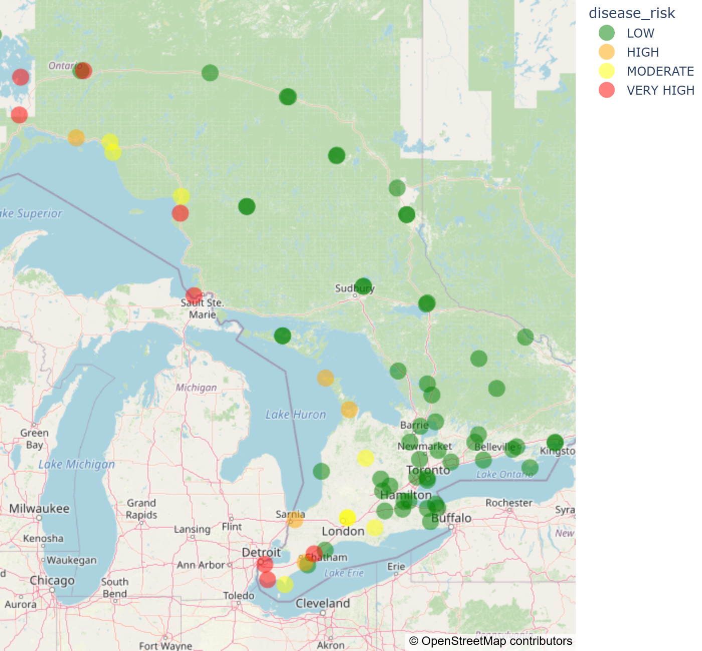

# Pest Forecasting (Ontario)

This project assesses the risk of pest and disease development in Ontario crops using weather-driven models.  
It uses hourly weather data from Environment and Climate Change Canada to compute daily disease severity values (DSVs), cumulative risk indicators, and spray recommendations across weather stations in the province.

The workflow is designed for transparency, reproducibility, and exploratory analysis using Jupyter notebooks.

---

## Project Overview

The project:
- Collects **hourly weather data** from Environment Canada
- Aggregates weather conditions to a **daily station-level dataset**
- Computes **Disease Severity Values (DSVs)** based on temperature and wet-hour thresholds
- Translates DSVs into **daily risk categories**
- Accumulates DSVs over time to support **spray decision thresholds**
- Visualizes spatial risk patterns across Ontario using interactive maps

---

## Example Output

Below is an example of a daily disease risk map for Ontario, where each point represents a weather station and marker color indicates the daily disease risk level derived from weather conditions.



*Figure: Station-level daily disease risk across Ontario based on weather-driven Disease Severity Values (DSVs).*

---

## Project Structure
```
pest-forecasting/
│
├── notebooks/
│ ├── 01_weather_data_download.ipynb # Download and update hourly weather data
│ └── 02_pest_forecasting_analysis.ipynb # Daily aggregation, DSVs, risk & mapping
│
├── data/
│ ├── metadata/ # CSV with agricultural-relevant weather stations and EnvCan IDs
│ ├── raw/ # Local-only raw hourly weather data (ignored by Git)
│ └── processed/ # Local-only derived outputs (ignored by Git)
│
├── outputs/ # Exported visualizations
│
├── README.md
├── LICENSE
└── .gitignore
```
